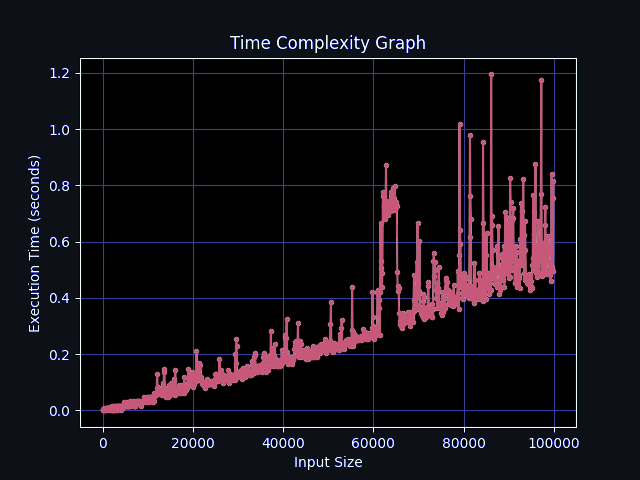

# Activity Selection Problem Using MergeSort (Greedy Method) :recycle:

This repository provides an efficient implementation of the Activity Selection Problem using the Merge Sort algorithm with a greedy approach. The Activity Selection Problem involves selecting a maximum number of non-overlapping activities from a given set, where each activity has a start time and an end time. The implementation utilizes the well-known Merge Sort algorithm, which divides the input array into smaller subarrays, sorts them, and then merges them back together. The greedy approach comes into play during the merging step, where the activities are sorted based on their end times. run: ./mergesortfinal/final.py

Incentive: The Activity Selection Problem is one of the algorithms out of three in our final group project of CSE373 course. The other two being QuickSort using Greedy method and HeapSort using Dynamic method done by other team mates in https://github.com/ZahinSam1/Advanced_Algorithms_Projects.git

Future Enhancements: There are several potential improvements that are planned to implement here in the future. Some suggestions includes a Visualizer to showcase the activity selection process step by step, aiding in better understanding and interactivity. Additional Scheduling algorithms to implement and compare other scheduling algorithms. Algorithm Optimization techniques to enhance the algorithm's time complexity or handle additional constraints, such as resource limitations or dependencies between activities.
Also to create an extensive set of test cases to validate the correctness of the algorithm and performance benchmarks to evaluate its efficiency on different input sizes.

